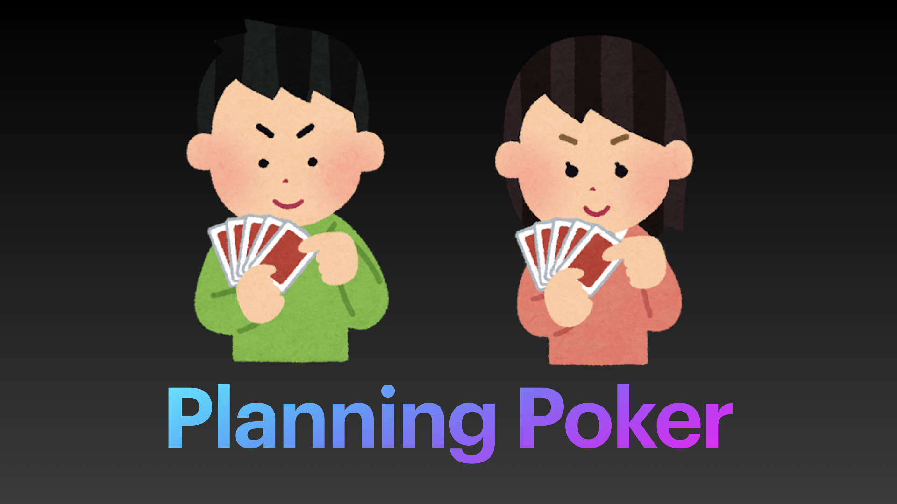

# wh.im Planning poker 



## Description

- [wh.im](https://wh.im/) running on the platform, [Planning Poker](https://tracpath.com/works/development/agile_planning_poker_and_userstory/) application.
- For now, for the Japanese.

## Using

```
yarn
yarn serve
```

## How to play

### English

#### Purpose of the game

- This is an app that allows you to play Planning Poker on wh.im.
- It allows each participant (1-8 people) to set up points for a story, discuss it and make relative estimates.

#### How to play Planning Poker

- Once all members of the planning team have entered the same room, the game begins.
- When you start the game, the available points will be displayed in the center of the screen.
- After an explanation of the Issue, there will be a question and answer session, and when you have decided on a point, press the button to confirm your selection.
    - You cannot cancel your vote, so if you have chosen the wrong point, you will have to reapply for your vote.
- When everyone has finished voting, the result will be displayed on the screen.
    - The points each person has voted for
    - Average of all points

#### Tips

- If the estimates don't match after three iterations, round up by adopting the "average of all points" or the "largest point" as your estimate.
    - The app will show you the average of all the points after the vote.
- Decide on the conditions under which the story (Issue) will be considered Done with its implementation.
- 'How big is one point roughly?' is a good idea to have a common understanding among members in advance.

### Japanese

#### ゲームの目的

- これは wh.im 上で[プランニングポーカー](https://tracpath.com/works/development/agile_planning_poker_and_userstory/)を行えるようにするアプリです。
- 参加者(1〜8人)がそれぞれストーリーに対してポイントを設定し、議論を重ねて相対的な見積りを行うことができます。

#### プランニングポーカーの進め方

- プランニングを行うメンバー全員が同じルームに入室したら、ゲームを開始します。
- ゲームを開始すると、選択可能なポイントが画面中央に表示されます。
- 対象となるストーリー(Issue)について説明があった後、質疑応答と経て、ポイントが決まったらボタンを押して確定します。
    - キャンセルはできませんので、誤ったポイントを選択した場合は投票をやり直してください。
- 全員の投票が終わると、画面に結果が表示されます。
    - 各自の投票したポイント
    - すべてのポイントの平均値

#### ヒント

- 3回繰り返しても見積もりが一致しない場合には、「すべてのポイントの平均値」もしくは「一番大きなポイント」を見積もりとして採用して切り上げましょう。
    - このアプリでは、投票後にすべてのポイントの平均値が表示されます。
- そのストーリー(Issue)が実装を完了した（Done）とみなす条件を決めましょう。
- 「1ポイントはだいたいどのくらいの規模か？」は、メンバー間で事前に共通認識を持っておくと良いでしょう。
